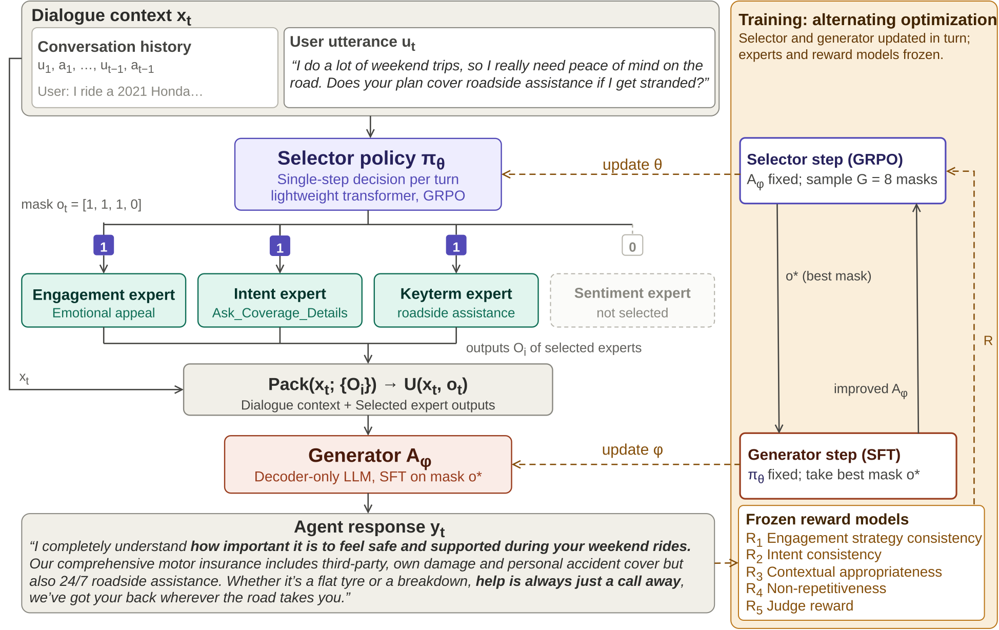

<h1 align="center">
PersuaRL: Reinforcement Learning-Driven Multi-Expert Selection<br>for Persuasive Dialogue Generation in Insurance
</h1>

<p align="center">
    Official implementation of <em>PersuaRL</em> and the <em>InsureDial</em> dataset.
</p>

<p align="center">
    <a href="#-quick-start"></a>
    <a href="docs/pipeline.md"></a>
    <a href="data/README.md"></a>
    <a href="LICENSE"></a>
</p>

Large language models are fluent but not, by default, *persuasive*. In a domain
like motor insurance an agent has to work out what the user actually wants, adapt
to how they feel, surface the right policy detail, and steer a decision without
pushing it. That is a lot to ask of a monolithic LLM in a single pass.

**PersuaRL** treats it as a sequential decision problem instead. A lightweight
**Selector**, trained with GRPO, learns *which subset of expert modules to
consult at each dialogue turn*. Four **Experts** analyse the turn along
complementary axes, and a **Generator** fuses the selected signals into a
response. A five-part composite reward, with no intermediate supervision, is what
teaches the Selector to balance intent alignment, emotional adaptation, strategy
selection, relevance and diversity.

Because the Selector's choice is a learned action rather than a fixed heuristic,
the Selector and Generator **co-adapt**: the Generator gets better at using the
routes the Selector picks, and the Selector finds routes the Generator handles
well.

---

## Table of contents

- [What is in this repo](#what-is-in-this-repo)
- [How it works](#how-it-works)
- [Results](#results)
- [Installation](#installation)
- [Quick start](#-quick-start)
- [The pipeline](#the-pipeline)
- [Using your own backbones](#using-your-own-backbones)
- [Ablations](#ablations)
- [Repository layout](#repository-layout)
- [Documentation](#documentation)
- [Citation](#citation)

---

## What is in this repo

| | |
|---|---|
| **The method** | Selector GRPO with constrained decoding, co-adapting Generator, and the full R1–R5 composite reward |
| **The dataset** | InsureDial: 1,931 dialogues, 13,383 turns, annotated on four dimensions, plus precomputed expert outputs |
| **The baselines** | single-shot, SFT, single-model GRPO, warm-start GRPO, AllExpert, prompted routing |
| **The ablations** | every table in Appendix D, each a flag on an existing script |
| **The evaluation** | BLEU-2, METEOR, BERTScore-F1, Distinct-2, ROUGE-1, perplexity, LLM-as-a-judge |

Any causal LM works as the Selector, the Generator or an expert. Backbones are
config values, and LoRA target modules are auto-detected per architecture.

---

## How it works

<p align="center">
  
</p>

**Selector.** At turn *t* the policy sees `(history, user utterance)` and emits a
binary mask `o_t ∈ {0,1}⁴`, one of **15 non-empty routes**, encoded as a single
constrained token `A`–`O`. One forward pass, one token, no JSON parsing and no
malformed-route retries.

**Experts.** Four decoder-only LMs, each LoRA fine-tuned for one subtask:

| expert | question it answers | output |
|---|---|---|
| Engagement | which persuasion strategy fits this turn? | one of 6 strategies + reason |
| Intent | what is the user trying to do? | one of 6 intents + reason |
| Keyterm | which domain terms matter here? | extracted terms + justification |
| Sentiment | what is the emotional tone? | positive / neutral / negative + reason |

**Generator.** Conditions on the selected experts' outputs, wrapped in
`<expert>…</expert>` tags, and produces the user-facing reply. Frozen while
rewards are computed; SFT'd on the best rollout of each GRPO group.

**Reward.** `R = 0.15·R1 + 0.15·R2 + 0.20·R3 + 0.15·R4 + 0.35·R5`, minus three
penalties that shape the *routing decision* rather than the response: complexity
(don't select everything), route repetition (keep exploring), and load balance
(keep all four experts contributing). Full derivation in
**[docs/rewards.md](docs/rewards.md)**.

> **On reward circularity.** RL updates *only* the selection policy. The
> Generator and every reward model stay frozen, so no gradient reaches the thing
> being evaluated or the thing doing the evaluating. That separation is why the
> human-evaluation gains track the automatic ones.

---

## Results

All numbers below are as reported in the paper. **PersuaRL was trained and
evaluated on four backbones only: Qwen 2.5 3B, Llama 3.2 3B, Phi-3 mini and
Mistral 24B.** The larger proprietary/open models (GPT-5, GPT-4.1 mini, DeepSeek
R1 Distill Llama 70B, Llama 3.3 70B, Qwen 3 32B, Phi-3-Medium 14B, Qwen 2.5 7B,
Llama 3.1 8B) appear only as single-shot reference points — PersuaRL was never
run on them.

**InsureDial** and out-of-domain **DEAL**. `Single → SFT → PersuaRL` improves
monotonically across every backbone it was actually run on.

| Dataset | Model | BLEU-2 ↑ | METEOR ↑ | BERT-F1 ↑ | Distinct-2 ↑ | ROUGE-1 ↑ | LLM-J ↑ |
|---|---|---|---|---|---|---|---|
| **InsureDial** | GPT-5 *(single-shot only)* | 0.036 | 0.093 | 0.828 | 0.982 | 0.232 | – |
| | GPT-4.1 mini *(single-shot only)* | 0.124 | 0.143 | 0.620 | 0.998 | 0.383 | – |
| | DeepSeek R1 Distill Llama 70B *(single-shot only)* | 0.069 | 0.125 | 0.569 | 0.920 | 0.260 | 4.25 |
| | Llama 3.3 70B Instruct *(single-shot only)* | 0.126 | 0.137 | 0.610 | 0.996 | 0.377 | 4.16 |
| | Qwen 3 32B *(single-shot only)* | 0.107 | 0.132 | 0.588 | 0.998 | 0.371 | 3.84 |
| | Phi-3-Medium 14B *(single-shot only)* | 0.169 | 0.167 | 0.655 | 0.995 | 0.441 | 3.78 |
| | Qwen 2.5 7B Instruct *(single-shot only)* | 0.124 | 0.145 | 0.604 | 0.958 | 0.385 | 3.66 |
| | Llama 3.1 8B Instruct *(single-shot only)* | 0.132 | 0.146 | 0.605 | 0.966 | 0.388 | 3.67 |
| | Qwen 2.5 3B (Single) | 0.090 | 0.128 | 0.562 | 0.965 | 0.310 | 2.66 |
| | Qwen 2.5 3B (SFT) | 0.305 | 0.217 | 0.727 | 0.991 | 0.556 | 3.28 |
| | **PersuaRL (Qwen 2.5 3B)** | **0.375** | **0.250** | **0.760** | **0.991** | **0.609** | **3.81** |
| | Llama 3.2 3B (Single) | 0.106 | 0.135 | 0.585 | 0.937 | 0.334 | 2.86 |
| | Llama 3.2 3B (SFT) | 0.339 | 0.232 | 0.742 | 0.989 | 0.584 | 3.48 |
| | **PersuaRL (Llama 3.2 3B)** | **0.398** | **0.276** | **0.771** | **0.989** | **0.631** | **3.95** |
| | Phi-3 mini 128k (Single) | 0.181 | 0.156 | 0.641 | 0.980 | 0.429 | 2.79 |
| | Phi-3 mini 128k (SFT) | 0.362 | 0.242 | 0.752 | 0.988 | 0.600 | 3.39 |
| | **PersuaRL (Phi-3 mini)** | **0.374** | **0.261** | **0.762** | **0.990** | **0.611** | **3.86** |
| | Mistral 24B (Single) | 0.043 | 0.094 | 0.772 | 0.898 | 0.195 | 3.02 |
| | Mistral 24B (SFT) | 0.324 | 0.226 | 0.815 | 0.990 | 0.574 | 3.65 |
| | **PersuaRL (Mistral 24B)** | **0.355** | **0.241** | **0.873** | **0.992** | **0.596** | **4.12** |
| **DEAL** (OOD) | Llama 3.2 3B (Single) | 0.049 | 0.085 | 0.519 | 0.937 | 0.195 | 2.41 |
| | Llama 3.2 3B (SFT) | 0.080 | 0.104 | 0.552 | 0.986 | 0.267 | 2.64 |
| | **PersuaRL (Llama 3.2 3B)** | **0.087** | 0.101 | 0.536 | **0.987** | **0.278** | **2.79** |
| | Phi-3 mini 128k (Single) | 0.086 | 0.106 | 0.552 | 0.973 | 0.265 | 2.37 |
| | Phi-3 mini 128k (SFT) | 0.089 | 0.110 | 0.558 | 0.984 | 0.273 | 2.56 |
| | **PersuaRL (Phi-3 mini)** | **0.094** | **0.121** | **0.568** | **0.985** | **0.281** | **2.72** |

A 3B PersuaRL model beats 14–70B single-shot baselines on BERT-F1: PersuaRL
(Phi-3 mini) exceeds Phi-3-Medium 14B by roughly 16% and Qwen 3 32B by over 29%.

**Human evaluation** (5-point scale, domain experts, 30% of the test set) —
run on the three backbones PersuaRL was actually trained on:

| Model | Fluency | Engagingness | Persuasive Eff. | Strategy Approp. | Resistance Handling |
|---|---|---|---|---|---|
| Llama 3.2 3B (SFT) | 3.11 | 2.94 | 2.46 | 2.88 | 3.38 |
| **PersuaRL (Llama 3.2 3B)** | **4.12** | **4.39** | **4.36** | **4.29** | **4.46** |
| Qwen 2.5 3B (SFT) | 3.19 | 2.98 | 2.86 | 3.10 | 3.61 |
| **PersuaRL (Qwen 2.5 3B)** | **3.94** | **4.22** | **4.23** | **4.06** | **4.32** |
| Mistral 24B (SFT) | 3.23 | 3.34 | 3.10 | 3.19 | 3.76 |
| **PersuaRL (Mistral 24B)** | **4.26** | **4.39** | **4.54** | **4.33** | **4.45** |

Reward-guided selection also beats prompted routing on the same backbone:
PersuaRL (Llama 3.2 3B) reaches ROUGE-1 0.631 against 0.572 for prompted tool
selection, and PersuaRL consistently outperforms the AllExpert baseline (all
experts always on) across BLEU-2, BERT-F1 and ROUGE-1 on both the Llama-3B and
Phi-3-mini backbones.

---

## Installation

```bash
git clone <repository-url> PersuaRL
cd PersuaRL

conda create -n persuarl python=3.10 -y
conda activate persuarl

# Install torch FIRST, matched to your CUDA version -- pip cannot pick the
# right wheel from requirements.txt and will hand you a CPU build.
pip install torch --index-url https://download.pytorch.org/whl/cu121

bash scripts/setup_env.sh --no-torch
```

`setup_env.sh` installs the package, fetches the NLTK tokenizer data, creates
`.env` from the template, and prints a verification report.

Then edit `.env`. At minimum set `HF_TOKEN` if you plan to use gated backbones
(Llama, Mistral):

```bash
DATA_ROOT=./data
MODELS_ROOT=./outputs
HF_TOKEN=hf_...
CUDA_VISIBLE_DEVICES=0
```

**Requirements.** One A100 80GB reproduces the paper (~25–28 h per model).
See [docs/pipeline.md#hardware](docs/pipeline.md#hardware) for fitting on less.

---

## 🚀 Quick start

The whole pipeline, one command:

```bash
bash scripts/run_all.sh --skip-experts
```

`--skip-experts` uses the precomputed expert annotations that ship with the repo,
which is what the paper's experiments do. Drop it to fine-tune the four expert
modules yourself.

Or stage by stage:

```bash
bash scripts/prepare_data.sh                     # 0. derive training files          (<1 min)
bash scripts/rewards/train_reward_models.sh      # 2. R1/R2 classifiers + prototypes (~15 min)
bash scripts/sft/train_generator_sft.sh          # 3. generator warm start           (~3-4 h)
bash scripts/rl/train_persuarl.sh                # 4. selector GRPO                  (~25-28 h)
bash scripts/inference/run_pipeline.sh           # 5. inference on the test split
bash scripts/eval/compute_metrics.sh results/persuarl.csv   # 6. metrics
```

Just want to see it move? A five-minute smoke run, no judge, twenty
conversations:

```bash
bash scripts/prepare_data.sh
bash scripts/rl/train_persuarl.sh --no-judge --set train.epochs=0.01
bash scripts/inference/run_pipeline.sh --limit 20 --verbose
```

> **The one thing not to skip: Stage 3.** An un-adapted Generator cannot exploit
> the `<expert>` blocks, so every route produces a comparably mediocre response,
> every rollout in a GRPO group scores alike, and the Selector receives no
> gradient. That is Table 15 in the paper, and it is the most common way to get a
> run that trains without improving.

---

## The pipeline

The seven stages run in order, each writing into `$MODELS_ROOT` where the next
one picks it up. Three also feed sideways into Stage 4: Stage 1 caches the
expert answers GRPO scores against, Stage 2 trains its R1/R2 classifiers, and
Stage 3 is the generator it warm-starts from.

| stage | script | writes | time |
|---|---|---|---|
| 0. data prep | `scripts/prepare_data.sh` | `data/processed/` | <1 min |
| 1. experts *(optional)* | `scripts/experts/train_all_experts.sh` | `$MODELS_ROOT/experts/` | ~3 h |
| 2. reward models | `scripts/rewards/train_reward_models.sh` | `$MODELS_ROOT/reward_models/` | ~15 min |
| 3. generator SFT | `scripts/sft/train_generator_sft.sh` | `$MODELS_ROOT/generator_sft/` | ~3–4 h |
| 4. **PersuaRL** | `scripts/rl/train_persuarl.sh` | `$MODELS_ROOT/persuarl/` | ~25–28 h |
| 5. inference | `scripts/inference/run_pipeline.sh` | `results/*.csv` | ~1 h |
| 6. evaluation | `scripts/eval/compute_metrics.sh` | `results/metrics/` | ~10 min |

Stage 1 is optional because the repo ships expert annotations for every turn.
Train the experts if you want a different backbone, a different label space, or
to annotate a new corpus.

**[docs/pipeline.md](docs/pipeline.md)** has the full detail, including what to
watch during RL and what each signal means when it goes wrong.

### Baselines

```bash
bash scripts/sft/train_baseline_sft.sh meta-llama/Llama-3.2-3B-Instruct   # SFT
bash scripts/rl/train_grpo_single.sh   meta-llama/Llama-3.2-3B-Instruct   # GRPO
bash scripts/rl/train_grpo_warmstart.sh                                   # SFT → GRPO
bash scripts/inference/run_pipeline.sh --mode all                         # AllExpert
bash scripts/inference/run_pipeline.sh --mode prompting                   # prompted routing
```

---

## Using your own backbones

Every model in the system is a config value. SFT and GRPO both work on any causal
LM without touching code. LoRA target modules are detected from the loaded
model, so Llama's separate `q_proj`/`k_proj`/`v_proj`, Phi-3's fused `qkv_proj`
and GPT-NeoX's `query_key_value` are all handled.

```bash
# SFT any model
bash scripts/sft/train_baseline_sft.sh Qwen/Qwen2.5-3B-Instruct
bash scripts/sft/train_baseline_sft.sh mistralai/Mistral-Small-24B-Instruct-2501

# GRPO any model
bash scripts/rl/train_grpo_single.sh microsoft/Phi-3-mini-128k-instruct

# Mix and match the PersuaRL components
bash scripts/rl/train_persuarl.sh \
    --selector  meta-llama/Llama-3.2-3B-Instruct \
    --generator microsoft/Phi-3-mini-128k-instruct
```

Every config key is overridable from the command line:

```bash
bash scripts/rl/train_persuarl.sh \
    --set train.num_generations=12 \
    --set rewards.weights.judge=0.25 \
    --set generator.quantization.bits=4
```

Ready-made backbone configs live in [`configs/models/`](configs/models/).

---

## Ablations

Every ablation in the paper is a flag, not a fork:

```bash
bash scripts/rl/train_persuarl.sh --ablate engagement       # Table 12: drop R1
bash scripts/rl/train_persuarl.sh --freeze-generator        # Table 14: no co-adaptation
bash scripts/inference/run_pipeline.sh --mode all           # Table 16: AllExpert
bash scripts/inference/run_pipeline.sh --mode prompting     # Fig. 2/4/5: prompted routing
bash scripts/rl/train_grpo_single.sh                        # Table 13: GRPO, no selector
```

Reward ablation on Qwen 2.5 3B (Table 11). R1, R2 and R5 are load-bearing:

| configuration | BLEU-2 | METEOR | BERT-F1 | Distinct-2 | ROUGE-1 |
|---|---|---|---|---|---|
| **PersuaRL (full)** | **0.375** | **0.250** | **0.760** | **0.991** | **0.609** |
| − R1 engagement | 0.341 | 0.214 | 0.694 | 0.965 | 0.521 |
| − R2 intent | 0.349 | 0.220 | 0.706 | 0.969 | 0.536 |
| − R3 contextual | 0.351 | 0.229 | 0.721 | 0.985 | 0.563 |
| − R4 repetition | 0.357 | 0.234 | 0.729 | 0.989 | 0.571 |
| − R5 judge | 0.342 | 0.219 | 0.701 | 0.966 | 0.529 |
| − (R1 + R2) | 0.335 | 0.211 | 0.691 | 0.961 | 0.511 |
| no rewards | 0.323 | 0.205 | 0.684 | 0.948 | 0.501 |

The full ablation map is in
[docs/pipeline.md#ablation-map](docs/pipeline.md#ablation-map).

---

## Repository layout

```
PersuaRL/
├── configs/              YAML experiments (defaults chains + --set overrides)
│   ├── models/             one file per backbone
│   ├── experts/            per-expert fine-tuning
│   ├── rewards/            composite reward + classifier training
│   ├── sft/ rl/            training stages
│   └── inference/ eval/    evaluation
├── data/                 InsureDial + precomputed expert outputs  (see data/README.md)
├── docs/                 pipeline, rewards, architecture, troubleshooting
├── scripts/              one shell entry point per stage
├── src/persuarl/
│   ├── routes.py           the 15-route action space
│   ├── data/               loading, splitting, prompts, prompt masking
│   ├── models/             backbone-agnostic loading + constrained decoding
│   ├── experts/            the four expert modules (registry + one trainer)
│   ├── rewards/            R1-R5, penalties, composite
│   ├── training/           SFT, selector GRPO, single-model GRPO
│   ├── inference/          the full pipeline
│   ├── evaluation/         automatic metrics
│   └── cli/                thin argparse wrappers
└── tests/                95 tests, no GPU, no downloads
```

```bash
make test    # or: python -m pytest tests/ -v
```

---

## Documentation

| document | what it covers |
|---|---|
| **[docs/pipeline.md](docs/pipeline.md)** | every stage in detail, what to watch during RL, the ablation map, hardware |
| **[docs/rewards.md](docs/rewards.md)** | R1–R5 derivations, the penalties, weight tuning, reward circularity |
| **[docs/architecture.md](docs/architecture.md)** | code layout, design decisions, how to extend |
| **[docs/troubleshooting.md](docs/troubleshooting.md)** | OOM, collapsed policies, flat rewards, gated downloads |
| **[data/README.md](data/README.md)** | InsureDial schema, label spaces, expert-output formats |

---

## Limitations

Stated plainly, following the paper:

- InsureDial is built with a semi-automated pipeline where GPT-4o generates
  dialogues that humans then filter. It may carry synthetic artefacts and does
  not fully capture real user behaviour.
- The selection policy operates over a binary mask, so the action space grows
  exponentially in the number of experts. GRPO stabilises learning over it, but
  it does not make it scale indefinitely.
- Invoking several experts per turn costs latency and compute. PersuaRL takes
  ~1.4× the inference time of an SFT baseline. That is a deliberate trade, not a
  free lunch.
- The framework is evaluated on 3B–30B backbones. Running the full pipeline with
  large LLMs as *both* Selector and Generator was not feasible under the
  available compute.

**Ethics.** This work treats persuasion as decision *support*, not decision
enforcement: responses align with user intent, sentiment and context without
coercive or repetitive pressure. Because inaccuracies in insurance can cause
financial harm, InsureDial was built with domain experts verifying model-generated
dialogues and annotations.

---

## Citation

```bibtex
@misc{kirti2026persuarlreinforcementlearningdrivenmultiexpert,
      title={PersuaRL: Reinforcement Learning-Driven Multi-Expert Selection for Persuasive Dialogue Generation in Insurance}, 
      author={Rohan Kirti and Akash Ghosh and Aryan Vats and Niladri Ghosh and Shipra Shriparn and Roshni Ramnani and Anutosh Maitra and Sriparna Saha},
      year={2026},
      eprint={2609.01188},
      archivePrefix={arXiv},
      primaryClass={cs.CL},
      url={https://arxiv.org/abs/2609.01188}, 
}
```

## Acknowledgements

Built on [TRL](https://github.com/huggingface/trl) (GRPO),
[PEFT](https://github.com/huggingface/peft) (LoRA/QLoRA),
[Transformers](https://github.com/huggingface/transformers),
[BERTScore](https://github.com/Tiiiger/bert_score), and
[Prometheus-2](https://github.com/prometheus-eval/prometheus-eval) as the
LLM-as-a-judge reward model. Thanks to the authors of all five.

## License

MIT. See [LICENSE](LICENSE). InsureDial is released for research use; see
[data/README.md](data/README.md#ethics-and-intended-use).
